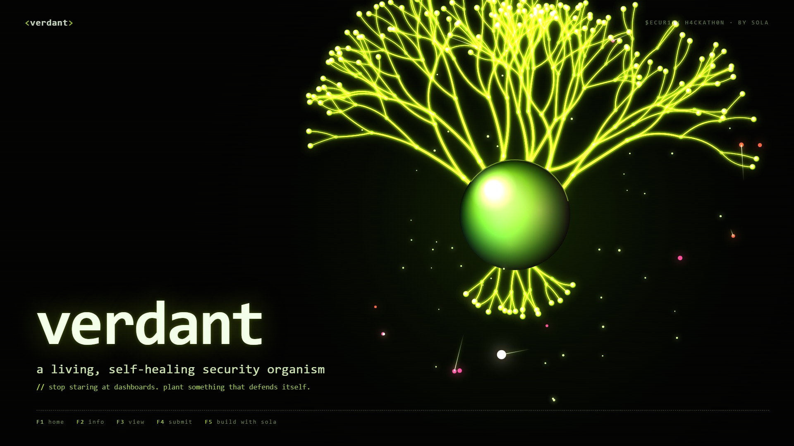

<div align="center">

# `verdant`

### a living, self-healing security organism

**Every other entry in this hackathon is a dashboard. Verdant is a living thing.**

[](https://verdant-sola.vercel.app)
[](https://sola.security)

[](LICENSE)



</div>

---

Alert fatigue is a **perception** problem, not a data problem. A wall of red rows trains you to ignore it.

Verdant turns your organization's security posture into a single, living image: a plant, grown in real time from your actual connected environment via the Sola MCP, defended by a swarm of autonomous agents. You don't read it — you watch it. It blooms when you're covered and wilts when you're exposed, and a CISO, an engineer, and a board member all understand it in three seconds.

**→ Live: [verdant-sola.vercel.app](https://verdant-sola.vercel.app)**

## What you're looking at

| On screen | What it really is |
|---|---|
| 🌱 the plant | your attack surface, grown live from connected sources |
| 🌗 bloom & color | your security posture — healthy at a glance |
| ✦ drifting agents | autonomous Sola-powered triage agents (the immune system) |
| 🔴 red virus-motes | **real** findings from Sola (leaked key, dormant admin, risky OAuth grant, unencrypted bucket, endpoint detection) |
| ⚡ a "kill" | autonomous triage + a routed handoff to Slack |
| 🥀 wilting | unaddressed risk accumulating until someone resolves it |

## How it works

```
 Sola MCP ──► findings engine ──► simulation state ──► WebGL renderer
 (read-only)   (Node worker)       (shared store)       (Three.js)
     │                                   │
     └── GitHub · Okta · AWS · CrowdStrike      └── Slack handoff (proposed fix)
```

**1. Findings engine** (`/server`). A Node worker polls the Sola unified security graph through the MCP's read-only tools (`execute_sql` over the normalized graph). It deduplicates one careless human across Okta, GitHub, AWS and CrowdStrike into a **single** finding — the identity graph is the heart muscle — scores it, and emits it onto the simulation bus. Each real finding becomes one virus-mote.

**2. Simulation** (`/src/sim`). Findings drive an emergent system — independent agents and threats interacting with no central script, the way a real immune system has no manager. Plant growth uses a **space-colonization** algorithm; agents use **Boids** flocking + **particle-life** predation; intensity tracks live posture. The art *renders* the data; it never invents it.

**3. Handoff** (`/server/slack.ts`). Sola is **read-only** — its one native write is Slack. So a "kill" ends in a real, deduplicated, prioritized Slack message with a *proposed* fix (PR / Jira card). Verdant never silently mutates production; the "healing" is a human resolving a well-triaged finding, or a noisy alert being correctly dismissed. That's the boring work Sola makes less annoying — Verdant just makes it something you want to look at.

## Tech stack

- **Three.js** — `iridescence` + `transmission` + `clearcoat` materials, HDR environment, **bloom** postprocessing (the glossy holographic look, in the boring.security palette: pure black, acid-lime `#C6F432`, white monospace)
- **React + Vite + TypeScript** front end; GPU-instanced particles
- **Node** findings worker; **@modelcontextprotocol/sdk** client for the Sola MCP
- **Vercel** (static front end + edge functions); pre-rendered poster that hydrates into the live sim

Inspired by the artificial-life work of **[Emergent Garden](https://www.youtube.com/c/EmergentGarden)** (Lenia, Boids, particle life, neural cellular automata).

## Run it locally

```bash
git clone https://github.com/RemiKG/verdant
cd verdant
npm install

cp .env.example .env      # fill in the values below

npm run dev               # http://localhost:5173
```

`.env`:

```ini
SOLA_MCP_URL=https://mcp.sola.security
SOLA_API_KEY=sk_sola_...
SLACK_WEBHOOK_URL=https://hooks.slack.com/services/...
# data-source connections are configured inside your Sola workspace
```

```
verdant/
├─ src/
│  ├─ sim/          # space-colonization growth, boids, particle-life
│  ├─ render/       # three.js scene, iridescent materials, bloom
│  └─ ui/           # terminal chrome, live counters
├─ server/
│  ├─ findings.ts   # Sola MCP polling + dedup + scoring
│  └─ slack.ts      # routed handoff
└─ docs/
```

## Data sources

**Required:** GitHub · Okta · AWS · CrowdStrike  **·  Connectors:** Slack · Jira

A connected GitHub account is enough to grow your first organism — connect the rest in your Sola workspace to light up the full body.

## Performance & fallback

The internet votes on phones, so the hero is built to never block: an instant pre-rendered poster paints first, then **hydrates** into the live WebGL sim. `prefers-reduced-motion` and low-tier GPUs fall back to the poster plus a lightweight 2D canvas. Capped DPR, instanced draws, GPU particles — budgeted for 60fps on mid-range hardware.

## Roadmap

- [ ] `verdant connect` — public mode: grow your *own* org from a single GitHub OAuth and share it
- [ ] Time-lapse: replay a week of your posture in 10 seconds
- [ ] Per-organ drill-down (click an organ → the findings behind it)
- [ ] Additional sources: Entra ID, Google Workspace, SentinelOne

## License

MIT © 2026 Kenneth Chen
